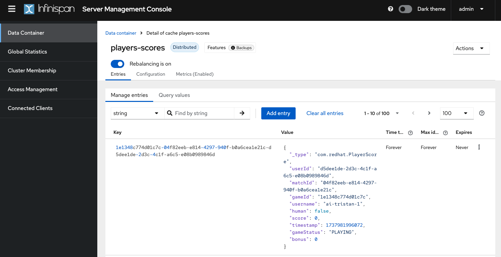

# Bilbo Stack 2025

## Requirements:
- Docker / Podman
- Java 21+

## Spin Up Infinispan

The Docker Compose file sets up:
- A LON cluster with 3 nodes
- A NYC cluster with 1 node

Both clusters use Cross Site replication.

```shell
docker/podman compose up
```

- Log in to **LON** at `localhost:11222` (user: **admin**, password: **pass**)
- Log in to **NYC** at `localhost:31222` (user: **admin**, password: **pass**)

## Build and Run the Quarkus Project

The leaderboard is a Quarkus app that shows the top 10 players. 
Data is stored in Infinispan with Protobuf serialization.
Build and run the application:

```shell
./mvnw clean install 
java -jar ./target/quarkus-app/quarkus-run.jar
```

Visit [http://localhost:8080](http://localhost:8080) to view the app.

This demo doesn't use indexed caches for simplicity. 
Adding indexing is recommended for better query performance.

You should be able to see in the console (LON and NYC):



## Testing Cross-Site Replication

The app creates a cache in NYC, using active-active replication:
- LON is the backup for NYC
- NYC is the backup for LON

Test and remove caches via the cache creation wizard in the console.

## Presentation
Here is the PDF holding presentation slides

* [Bilbostack - 2025.pdf (spanish)](Bilbostack%20-%202025.pdf)
* [Bilbostack - 2025.pdf (english)](EN_Bilbostack%20-%202025.pdf)

## Go further
* Infinispan https://infinispan.org/get-started/
* Quarkus https://quarkus.io/get-started/